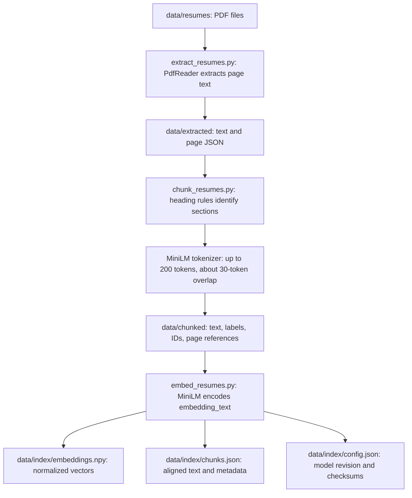
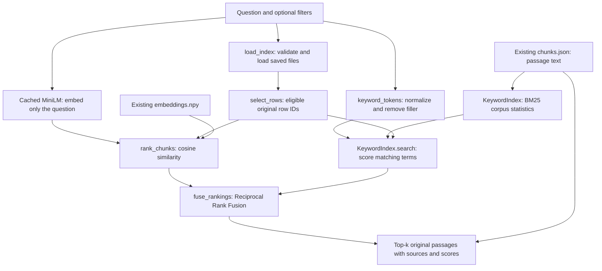
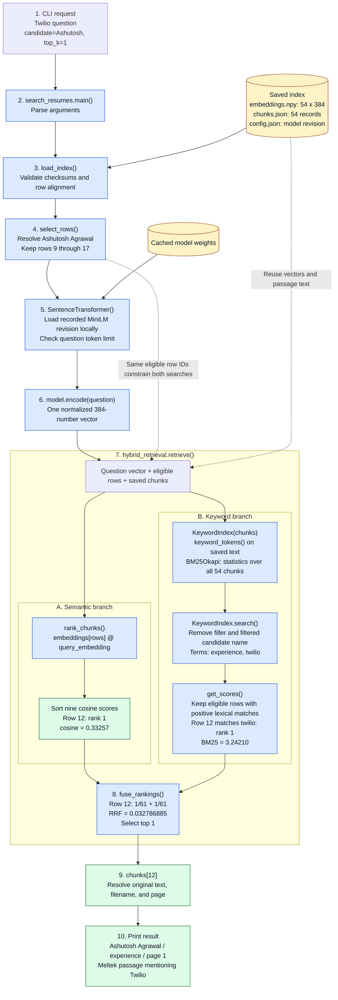
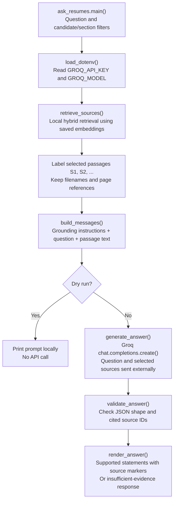

# Resume RAG: architecture and request flow

[Back to the implementation overview](README.md)

A learning project that extracts resume PDFs, splits them into sections and chunks, creates local embeddings, and retrieves passages using semantic search plus BM25 keyword search.

**Current scope:** local retrieval with source references plus Groq answer generation. The local and mocked-request checks pass; live answer evaluation requires a configured Groq API key. The current dataset contains six resumes and 54 chunks, represented by a `(54, 384)` embedding matrix. These counts change when documents are rebuilt.

## Run a search

From the `resume-rag` folder:

```bash
source .venv/bin/activate
python search_resumes.py "What experience does Ashutosh have with Twilio?" --candidate Ashutosh --top-k 1
```

Hybrid search is the default. Compare the available methods:

```bash
python search_resumes.py "Twilio" --candidate Ashutosh --mode hybrid
python search_resumes.py "Twilio" --candidate Ashutosh --mode semantic
python search_resumes.py "Twilio" --candidate Ashutosh --mode keyword
```

| Argument | Behavior |
| --- | --- |
| `question` | Required search text; enclose it in quotation marks |
| `--candidate` | Optional full name or unambiguous substring, ignoring case and extra spaces |
| `--section experience` | Optional normalized section label; also supports labels such as `skills` and `projects` |
| `--top-k 3` | Maximum results displayed; defaults to 3 |
| `--mode hybrid` | Semantic + keyword ranks combined with RRF; the default |
| `--mode semantic` | Original cosine-based ranking |
| `--mode keyword` | BM25 ranking; skips loading the embedding model |

All search modes read the existing index. Candidate names are not automatically extracted from questions: use `--candidate` when that restriction matters.

## Architecture

### Preparing documents and embeddings



Heading aliases map labels such as “Work Experience” and “Professional Experience” to `experience`. Introductory text is retained as `unclassified`. Chunking does not cross section or resume boundaries. Each chunk's `embedding_text` includes the candidate name and section label before the passage.

### Searching with the existing index



The branches show two logical search methods. The current Python implementation executes them sequentially, not in parallel.

## What changed with hybrid retrieval?

| Component | Earlier semantic search | Current hybrid search |
| --- | --- | --- |
| Resume embeddings | Read saved MiniLM vectors | Reuses those same vectors |
| Question | Encoded by cached MiniLM | Encoded by the same model and recorded revision |
| Passage text | Used to display results | Also used to build an in-memory BM25 index |
| Ranking | Cosine similarity | RRF combines semantic and keyword rank positions |
| Filtering | Candidate and section | Same filters constrain both result lists |
| Output | Cosine score and source text | RRF, cosine, BM25, matching terms, and source text |

**No resume embeddings are regenerated during search.** BM25 creates no embeddings: it uses term statistics from the saved passage text. The CLI constructs its small keyword index in memory on each invocation. Statistics use all 54 chunks; only eligible rows can become results. The evaluation script reuses a keyword index across its questions.

`embeddings[i]` corresponds to `chunks[i]`, whose `embedding_row` must equal `i`. Filtering preserves these original row IDs so search cannot accidentally display another chunk's text.

## Call trace: a Twilio search

This is a function-level walkthrough of an actual local run on the current index, not a new CLI tracing flag. Scores and row IDs can change after rebuilding the data.

```bash
python search_resumes.py "What experience does Ashutosh have with Twilio?" --candidate Ashutosh --top-k 1
```

Read the numbered boxes from top to bottom. The retrieval branches are drawn side by side to show their roles; the code executes semantic ranking before keyword ranking.



**Data at the key boundaries:**

| Boundary | Data passed onward |
| --- | --- |
| After loading | A `(54, 384)` matrix, 54 chunk records, model configuration |
| After filtering | Original rows `[9, 10, 11, 12, 13, 14, 15, 16, 17]` |
| After question encoding | One `(384,)` vector; resume vectors remain unchanged |
| Semantic output | Ordered original row IDs and cosine scores |
| Keyword output | Ordered eligible row IDs, BM25 scores, and matched terms |
| Fusion output | Row `12`, component ranks/scores, and matched term `twilio` |
| Display | `chunks[12]`, ID `b6f733d8c461:s4:c1`, and its PDF/page references |

The trace describes hybrid mode. In keyword mode, steps 5 and 6 are skipped and BM25 ranking goes directly to display. In semantic mode, the displayed ranking uses cosine only; the shared `retrieve()` helper still computes keyword matches internally but does not fuse them.

Verified result summary (passage omitted here):

```text
1. Ashutosh Agrawal | experience | RRF=0.03279 | cosine=0.333 | BM25=3.242
Keyword matches: twilio
Source: Ashutosh_Agrawal_Resume.pdf | pages: 1 | b6f733d8c461:s4:c1
```

### Understanding the three scores

- **Cosine:** compares the question vector with a whole passage vector. Because both vectors are normalized, dot product equals cosine similarity. An exact phrase inside a longer passage does not imply a score near 1.
- **BM25:** rewards matching query terms using frequency, corpus rarity, and passage length. It has a different scale from cosine. It is not a quoted-phrase matcher and does not require every query term to match.
- **RRF:** combines rank positions, not raw BM25 and cosine values: `sum(1 / (60 + rank))`. Missing membership in a ranking contributes zero. Ranks start at 1; the constant 60 is unrelated to `--top-k`. With two lists, the largest possible score here is approximately 0.03279.

**None of these scores is accuracy or confidence.** With no positive keyword hits, hybrid ordering falls back to the semantic ranking. Keyword-only mode instead returns no results. Neither behavior proves whether an answer exists in the documents.

## Files and responsibilities

| File | Responsibility | 
| --- | --- |
| [extract_resumes.py](extract_resumes.py) | PDF text extraction with page tracking |
| [chunk_resumes.py](chunk_resumes.py) | Heading rules, token budgets, overlap, and source metadata |
| [embed_resumes.py](embed_resumes.py) | Local MiniLM encoding and index persistence |
| [search_resumes.py](search_resumes.py) | CLI, index validation, filters, question embedding, and printing |
| [hybrid_retrieval.py](hybrid_retrieval.py) | Cosine ranking, lexical tokenization, BM25, and RRF |
| [evaluate_retrieval.py](evaluate_retrieval.py) | Semantic/hybrid comparison against visible passage labels |
| [requirements.txt](requirements.txt) | Python dependencies, including `rank-bm25` |

Step-by-step lessons: [plan](PLAN.md), [section-aware chunking](ITERATION_2.md), [embeddings](ITERATION_3.md), [semantic search](ITERATION_4.md), and [hybrid retrieval](ITERATION_5.md).

## Fresh setup and index building

The existing workspace is already configured. For a fresh setup, place your PDFs in `data/resumes/`, then run from the project folder:

```bash
python3 -m venv .venv
source .venv/bin/activate
python -m pip install -r requirements.txt
mkdir -p data/resumes models/all-MiniLM-L6-v2
curl -fL https://huggingface.co/sentence-transformers/all-MiniLM-L6-v2/resolve/main/tokenizer.json -o models/all-MiniLM-L6-v2/tokenizer.json
python extract_resumes.py
python chunk_resumes.py
python embed_resumes.py
```

Dependency and model downloads require network access. Text processing and embedding computation run locally; no resume text is uploaded. Search uses only cached model files. FAISS is not used. The separate ask_resumes.py command sends selected text and the question to Groq; search_resumes.py stays local.

When PDFs change, rerun extraction, chunking, and embedding in order. For deleted or renamed PDFs, also remove their old generated files from `data/extracted/` and `data/chunked/` before rebuilding. Automatic synchronization is not implemented. Index files and resume data are excluded from version control.

## Validation and known limitations

```bash
python -m unittest -v test_search_resumes.py test_hybrid_retrieval.py
python evaluate_retrieval.py
```

Nine focused search tests passed. The comparison report is written to `data/evaluation/retrieval_comparison.json`. It uses the uploaded resumes and visible, illustrative labels rather than an exhaustive or held-out benchmark.

Twilio and Con Edison ranked first in both methods. Some paraphrases did not improve; one labeled supporting passage moved from second to third. The employer-list question retrieved only one of three labeled employer passages in the top three with either method.

Remaining limitations include PDF spacing errors, overlapping evidence, chunks splitting job entries, no automatic name resolution from questions, and incomplete coverage for exhaustive questions. The lexical tokenizer is English-oriented and does not expand synonyms or fix OCR. Hybrid search can still return irrelevant passages, including contact headers, and cannot reliably reject unsupported questions. The generation stage checks citation IDs and response structure, but semantic grounding still requires live evaluation.

## References

- [MiniLM model documentation](https://huggingface.co/sentence-transformers/all-MiniLM-L6-v2)
- [BM25 Python library](https://github.com/dorianbrown/rank_bm25)
- [Reciprocal Rank Fusion explanation](https://learn.microsoft.com/en-us/azure/search/hybrid-search-ranking)


## Answer generation: iteration 6

API-key setup and run commands are in [ITERATION_6.md](ITERATION_6.md). Put the real key only in the local `.env` file. `--dry-run` previews the prompt without a Groq call.



Only the question and selected readable sources are sent to Groq; vectors stay local. The API returns structured statements and source IDs. The application resolves citation filenames and pages from its own metadata, rejecting unknown IDs and incomplete responses. These checks do not prove that the statements are supported by the cited text. Prompting requests insufficient-evidence handling, but live evaluation remains necessary.
